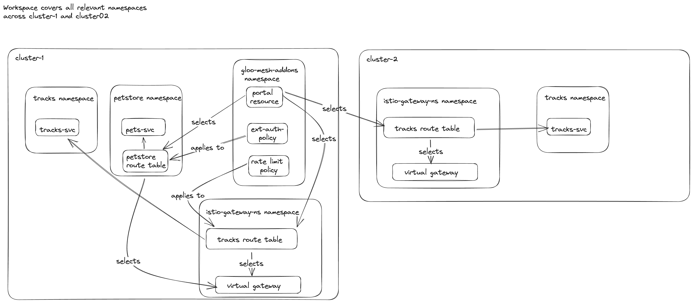

## Setup Overview



## Setup Instructions

1. Setup your local environment using the command `make setup-test-clusters TEST_CLUSTER_ARGS="--gloo-mesh --portal-server"` from the main branch 
2. Apply the mgmt cluster resources `k apply -f ./mgmt-cluster`
3. Create the `tracks` and `petstore` namespaces in  cluster-1. Create the `tracks` namespace in cluster-2.
4. Apply all cluster-1 resources `k apply -f ./cluster-1` wait a bit to ensure that the api docs for the pets and tracks services
are created, the images take a ~1 min to pull.
5. Apply all cluster-2 resources `k apply -f ./cluster-2` wait a bit to ensure that the api docs for the tracks services are created

## Testing

1. Inspect the `PortalConfig` by running `k get portalconfig -A -oyaml` in `cluster-1`. You should see the following:

```yaml
apiVersion: v1
items:
- apiVersion: internal.gloo.solo.io/v2
  kind: PortalConfig
  metadata:
    annotations:
      cluster.solo.io/cluster: ""
    creationTimestamp: "2023-07-18T18:00:32Z"
    generation: 1264
    labels:
      agent.gloo.solo.io: gloo-mesh
      cluster.multicluster.solo.io: ""
      context.mesh.gloo.solo.io/cluster: cluster-2
      context.mesh.gloo.solo.io/namespace: istio-gateway-ns
      context.mesh.gloo.solo.io/workspace: gloo-platform-multi-cluster-demo
      gloo.solo.io/parent_cluster: cluster-2
      gloo.solo.io/parent_group: ""
      gloo.solo.io/parent_kind: Namespace
      gloo.solo.io/parent_name: istio-gateway-ns
      gloo.solo.io/parent_namespace: ""
      gloo.solo.io/parent_version: v1
      owner.gloo.solo.io/name: gloo-mesh
      reconciler.mesh.gloo.solo.io/name: translator
      relay.solo.io/cluster: cluster-2
    name: developer-portal-gloo-mesh-addo-4309d5364aee067da0a20149fd6a909
    namespace: gloo-mesh-addons
    resourceVersion: "431924"
    uid: 25de6d1a-7ee5-4e4e-84d4-5237fca53f48
  spec:
    apis:
    - apiId: tracks-api-product-v2
      apiProductId: tracks-api-product
      apiSchema:
        cluster: cluster-2
        name: tracks-rt-stitched-openapi-gloo-platform-multi-cluster-demo-istio-gateway-ns-cluster-2
        namespace: gloo-mesh-addons
      apiVersion: v2
      description: REST API for Catstronauts to retrieve data for tracks, authors
        and modules.
      routeTable:
        cluster: cluster-2
        name: tracks-rt
        namespace: istio-gateway-ns
      title: Catstronauts REST API V2
    domains:
    - '*host'
    portalRef:
      cluster: cluster-1
      name: developer-portal
      namespace: gloo-mesh-addons
    public: true
kind: List
metadata:
  resourceVersion: ""
```

Note that this is incorrect, because no usage plans exist and the only the `tracks-api` in cluster-2 is exposed.

## Fix

1. Build the mgmt-server image from this branch `portal-fix-portal-config-overwritten-issue-10240`.
2. Replace the image in the mgmt-server deployment.
3. Inspect the `PortalConfig` by running `k get portalconfig -A -oyaml` in `cluster-1`. You should see the PortalConfigs with the correct apis:

 ```yaml
apiVersion: v1
items:
- apiVersion: internal.gloo.solo.io/v2
  kind: PortalConfig
  metadata:
    annotations:
      cluster.solo.io/cluster: ""
    creationTimestamp: "2023-07-18T20:35:08Z"
    generation: 371
    labels:
      agent.gloo.solo.io: gloo-mesh
      cluster.multicluster.solo.io: ""
      context.mesh.gloo.solo.io/cluster: cluster-1
      context.mesh.gloo.solo.io/namespace: istio-gateway-ns
      context.mesh.gloo.solo.io/workspace: gloo-platform-multi-cluster-demo
      gloo.solo.io/parent_cluster: cluster-1
      gloo.solo.io/parent_group: ""
      gloo.solo.io/parent_kind: Namespace
      gloo.solo.io/parent_name: istio-gateway-ns
      gloo.solo.io/parent_namespace: ""
      gloo.solo.io/parent_version: v1
      owner.gloo.solo.io/name: gloo-mesh
      reconciler.mesh.gloo.solo.io/name: translator
      relay.solo.io/cluster: cluster-1
    name: gloo-platform-multi-cluster-dem-3f641cb5f83487ff9450d6d6607685c
    namespace: gloo-mesh-addons
    resourceVersion: "440056"
    uid: 4cfcc103-b331-4e6d-b953-2895ddf6eae1
  spec:
    apis:
    - apiId: pestore-rest-api-v1
      apiProductId: pestore-rest-api
      apiSchema:
        cluster: cluster-1
        name: petstore-rt-stitched-openapi-gloo-platform-multi-cluster-demo-petstore-cluster-1
        namespace: gloo-mesh-addons
      apiVersion: v1
      description: REST API for PESTORE to retrieve data for tracks, authors and modules.
      routeTable:
        cluster: cluster-1
        name: petstore-rt
        namespace: petstore
      title: PESTORE REST API V1
    - apiId: tracks-api-product-v1
      apiProductId: tracks-api-product
      apiSchema:
        cluster: cluster-1
        name: tracks-rt-stitched-openapi-gloo-platform-multi-cluster-demo-istio-gateway-ns-cluster-1
        namespace: gloo-mesh-addons
      apiVersion: v1
      description: REST API for Catstronauts to retrieve data for tracks, authors
        and modules.
      routeTable:
        cluster: cluster-1
        name: tracks-rt
        namespace: istio-gateway-ns
      title: Catstronauts REST API V1
    domains:
    - '*host'
    portalRef:
      cluster: cluster-1
      name: developer-portal
      namespace: gloo-mesh-addons
    public: true
    usagePlans:
      - description: A basic usage plan
        displayName: Bronze Plan
        extAuthPolicies:
          - authConfigId: gloo-mesh-addons.portal-api-route-auth-gloo-mesh-4ac7fcc4ee668717937d7fe76d8ea80
            extAuthPolicyRef:
              cluster: cluster-1
              name: portal-api-route-auth
              namespace: gloo-mesh-addons
        name: bronze
        rateLimitPolicy:
          rateLimitPolicyRef:
            cluster: cluster-1
            name: tracks-rate-limit
            namespace: default
          requestsPerUnit: 1
          unit: MINUTE
      - description: A better usage plan
        extAuthPolicies:
          - authConfigId: gloo-mesh-addons.portal-api-route-auth-gloo-mesh-4ac7fcc4ee668717937d7fe76d8ea80
            extAuthPolicyRef:
              cluster: cluster-1
              name: portal-api-route-auth
              namespace: gloo-mesh-addons
        name: silver
        rateLimitPolicy:
          rateLimitPolicyRef:
            cluster: cluster-1
            name: tracks-rate-limit
            namespace: default
          requestsPerUnit: 3
          unit: MINUTE
      - description: The best usage plan!
        extAuthPolicies:
          - authConfigId: gloo-mesh-addons.portal-api-route-auth-gloo-mesh-4ac7fcc4ee668717937d7fe76d8ea80
            extAuthPolicyRef:
              cluster: cluster-1
              name: portal-api-route-auth
              namespace: gloo-mesh-addons
        name: gold
        rateLimitPolicy:
          rateLimitPolicyRef:
            cluster: cluster-1
            name: tracks-rate-limit
            namespace: default
          requestsPerUnit: 5
          unit: MINUTE
- apiVersion: internal.gloo.solo.io/v2
  kind: PortalConfig
  metadata:
    annotations:
      cluster.solo.io/cluster: ""
    creationTimestamp: "2023-07-18T20:35:08Z"
    generation: 1
    labels:
      agent.gloo.solo.io: gloo-mesh
      cluster.multicluster.solo.io: ""
      context.mesh.gloo.solo.io/cluster: cluster-2
      context.mesh.gloo.solo.io/namespace: istio-gateway-ns
      context.mesh.gloo.solo.io/workspace: gloo-platform-multi-cluster-demo
      gloo.solo.io/parent_cluster: cluster-2
      gloo.solo.io/parent_group: ""
      gloo.solo.io/parent_kind: Namespace
      gloo.solo.io/parent_name: istio-gateway-ns
      gloo.solo.io/parent_namespace: ""
      gloo.solo.io/parent_version: v1
      owner.gloo.solo.io/name: gloo-mesh
      reconciler.mesh.gloo.solo.io/name: translator
      relay.solo.io/cluster: cluster-1
    name: gloo-platform-multi-cluster-dem-7d23d8538c2c2f40b52d9acd850a145
    namespace: gloo-mesh-addons
    resourceVersion: "433206"
    uid: 3e86ad7e-4393-4a41-8c6b-b56e7677df4c
  spec:
    apis:
    - apiId: tracks-api-product-v2
      apiProductId: tracks-api-product
      apiSchema:
        cluster: cluster-1
        name: tracks-rt-stitched-openapi-gloo-platform-multi-cluster-demo-istio-gateway-ns-cluster-2
        namespace: gloo-mesh-addons
      apiVersion: v2
      description: REST API for Catstronauts to retrieve data for tracks, authors
        and modules.
      routeTable:
        cluster: cluster-2
        name: tracks-rt
        namespace: istio-gateway-ns
      title: Catstronauts REST API V2
    domains:
    - '*host'
    portalRef:
      cluster: cluster-1
      name: developer-portal
      namespace: gloo-mesh-addons
    public: true
kind: List
metadata:
  resourceVersion: ""
 ```   